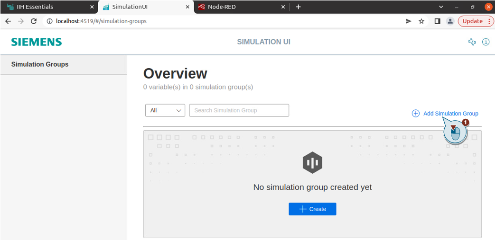
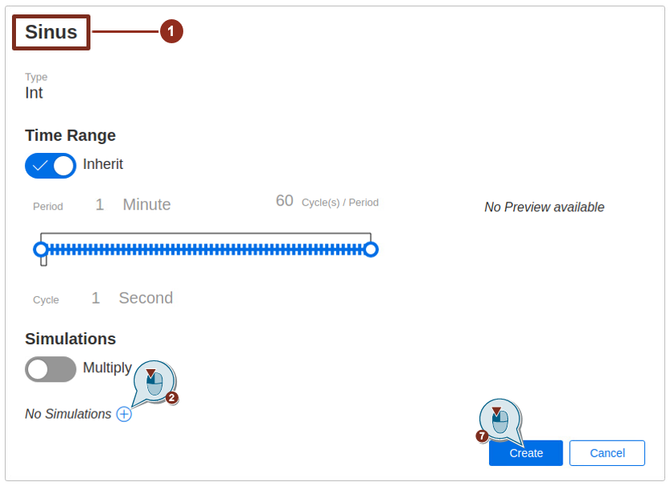
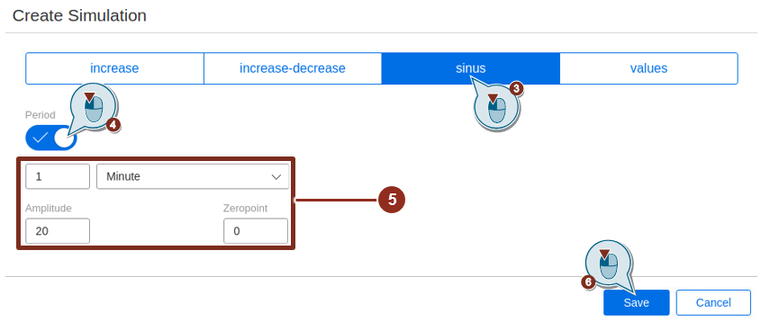
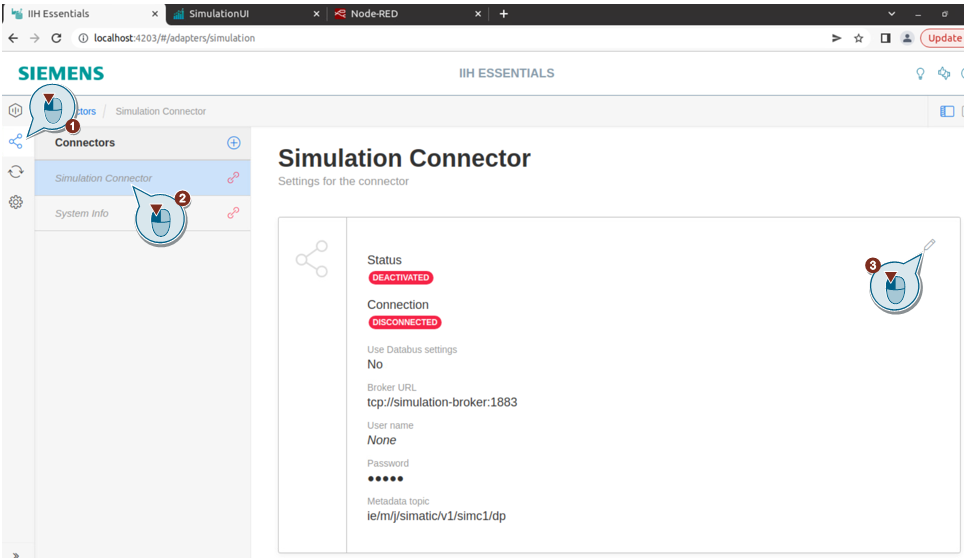
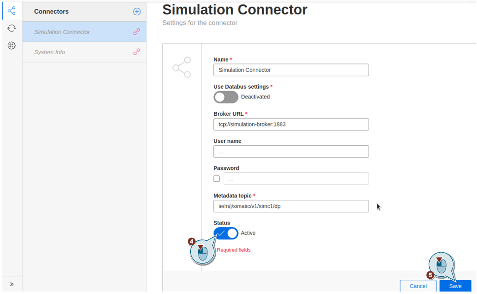
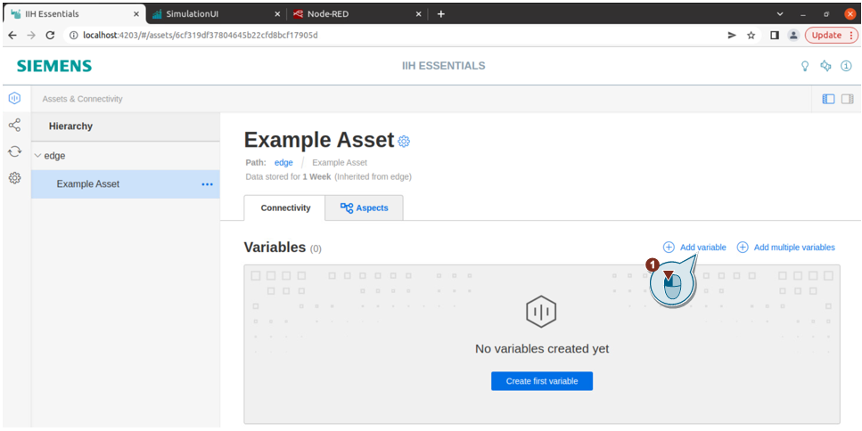
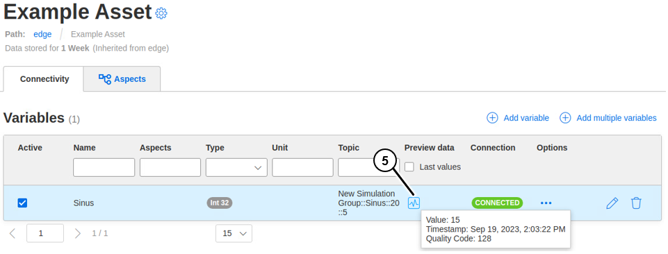
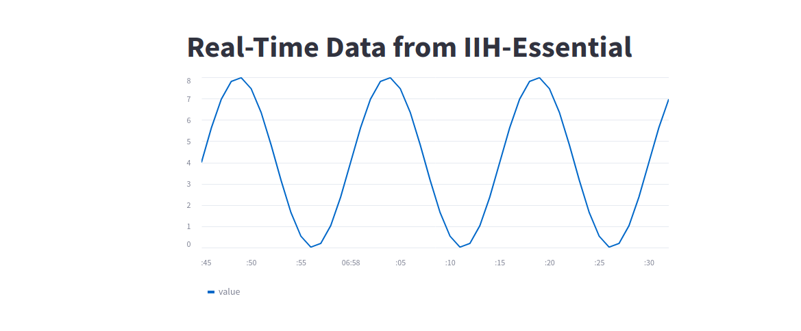

## Example 3 - Triangular wave using IIH Essentials

Triangular wave using IIH essentials - provided by the Development Kit - Create an application to form a **triangular** wave using **IIH essentials** and **IIH Simulator** as service to get data from **PLC** and visualize that data using **streamlit.**

1. Create your application - Enter the name and description of your application. Add service and select IIH Essentials from the dropdown. Proceed to app summary and review it.
2. Download your application - After reviewing the application, start generating the source code. Once the downlaod is complete you can extract the zip file in your desired location adn open it in VS Code.
3. Start services for application - Go to test workflow and start IIH Essentials and IIH Simultion.
4. PLC Configuration - Configure the PLC to send the data to IIH Essentials which can then send data to the application.
5. Create new Tag in Simulation UI.
To create a tag, follow these steps:
    - Open a browser.
    - To access the Simulation UI, enter the following address: `http://localhost:4519`
    - Add a simulation group with following configuration and create it
        - Period: 1 minute
        - Cycle: 1 second

  

  

6. Add a new simulation variable to the created group
   - set the name to "Sinus"
   - type should be "Int"
   - add a simulation with following configuration
     - choose "sinus"
     - Period: 1 minute
     - Amplitude: 20
     - Zeropoint: 0
     - click on "Save"
   - click on "Create"

  

  

  

7. Transfer Tag to IIH Essentials

To connect the tag to the IIH Essentials, follow these steps:

- Open a browser.
- To access the IIH Essentials UI, enter the following address: `http://localhost:4203`
- Go to connectors and configure the connector to get the data from the simulation

  

  

  If configured correctly, it should look like this:

  

- Create a new asset with following configuration and add it
    - Name: Example Asset

  

- Create a Variable with following configuration and add it
   - Connector: Simulation Connector
   - Choose the created Tag "New Simulation Group/Sinus"

  

  

  If the simulation variable has been successfully connected to the IIH Essentials, you can see the current value of the variable.

  

8. Business Logic - Add business logic to your application to generate a triangular wave using data received from IIH Essentials and IIH simulation. 
    ===> [Business logic source code for this example can be found here](./003_Example_003_src.md) <===

9. Build the Image - Once the code is ready, build the image. 

    Please navigate to your app repository/directory. To build your service, please append your service name with '_build'. In our example, the service we want to build is 'get-data-from-iih'. So the make command would look like below.

```
make get-data-from-iih_build
```

10. Run your application to test if it works as expected - Start the docker compose to check if the application is running on the desired port.You must be in the same path where the docker compose yml file is placed.

```
docker compose up
```

#### Expected Result



After successfull completion. You can expose the port in docker compose yml to build and publish the application in IEM. 

Once the local testing and debugging phase is completed, let's deploy your application by generation the .app file which can be sideloaded to IEM. Please go through the below page for steps.

===> [How to Deploy your application](../../001_pages/04_deploy_app/03-Deploy-Workflow.md)  <===
